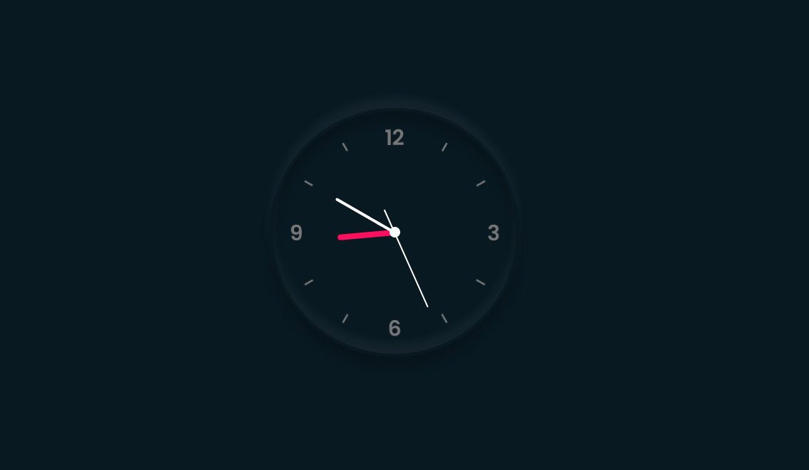

# 🌹 CSS - Clock   



## ✅ Description
- CSS로 만드는 __Clock App__   

----------------------

## ✅ Features
- 매초 마다 동작하는 시(hour), 분(Min), 초(Sec) 시계.

----------------------

## ✅ Language
1. HTML
2. Css(Scss)
3. JavaScript

## ✅ Install
```
npm install -d node-sass
```
